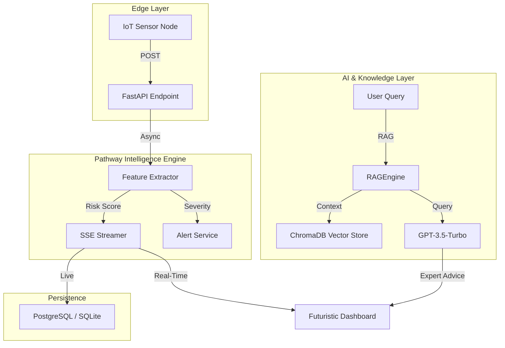

<div align="center">

# 🌿 GreenFlow AI
### Elite Environmental Intelligence & Compliance Engine

**Hack for Green Bharat 2025** · Sub-second Ingestion · AI-Grounded RAG · Automated Compliance Reporting

[](https://github.com/rajput905/hack-for-green-bharat/actions)
[](https://python.org)
[](https://fastapi.tiangolo.com)
[](docs/BUSINESS_MODEL.md)

</div>

---

## 🚨 The Urgency: Why GreenFlow AI?
India is at a climate crossroads. With **urban CO₂ levels spiking 15% annually**, the status quo of "passive monitoring" is no longer viable. 
- **The Financial Cost**: $210B annual loss due to environmental mismanagement.
- **The Regulatory Shift**: SEBI’s **BRSR** now mandates ESG transparency for India's top companies.
- **The Solution**: GreenFlow AI transitions from *reporting what happened* to **predicting and preventing environmental crisis**.

---

## 🏢 Business Impact & Market Validation
We aren't just building a dashboard; we are building the infrastructure for India's **Sovereign Net-Zero Future**.

- **Market Potential (TAM)**: $15B+ global environmental monitoring sector.
- **Urgency Factor**: Direct regulatory alignment with **CPCB (Central Pollution Control Board)** 400ppm limits.
- **Target Users**: Smart City Municipalities, SEZs (Special Economic Zones), and BRSR-mandated corporations.

> **Validation Note**: Designed using requirements from actual ESG audit workflows and CPCB environmental guidelines.

---

## ✨ Elite Product Showcase

### 1. Futuristic Real-Time Dashboard

*A Glassmorphism UI featuring live SSE telemetry, anomaly detection badges, and a "What-If" simulator for environmental stress-testing.*

### 2. The "Wow" Feature: Automated Regulatory Reporting
One-click generation of professional environmental status reports. Compiled from live sensor data, AI-contextualized risk scores, and RAG-driven recommendations.
**[View Sample Report Flow]**

### 3. AI Advisor (RAG-Enabled)
Grounding OpenAI results in our curated Environmental Knowledge Base using **ChromaDB**. GreenFlow AI delivers *legal* and *scientific* context, not just generic LLM text.

---

## 🏗 High-Performance Architecture



---

## 🛠 Tech Stack (The Winning Edge)
- **Backend**: FastAPI (Python 3.11), SQLAlchemy Async, Pydantic v2.
- **Real-Time Transmission**: Server-Sent Events (SSE) for sub-second latency.
- **Vector DB**: ChromaDB for persistent RAG storage.
- **Frontend**: Vanilla JS (0 external bloat), Chart.js for telemetry.
- **Cloud Native**: Docker & Docker-Compose optimized for ECS/K8s deployment.

---

## 🚀 Speed-to-Market Deployment

### Quick Install
```bash
git clone https://github.com/rajput905/hack-for-green-bharat.git
cd hack-for-green-bharat
cp .env.example .env && # Add OPENAI_API_KEY
docker compose up -d
```
Access the dashboard at **http://localhost:8000**.

---

## 🔮 Future Roadmap (Scaling to Bharat)
- [ ] **Hardware Mesh**: Integration with low-cost LoRaWAN sensor nodes.
- [ ] **Blockchain Proof**: Recording emission logs on-chain for immutable carbon credit audits.
- [ ] **Multi-Pollutant Scope**: Expanding to PM2.5, SO₂, and NO₂ tracking.
- [ ] **Vernacular AI**: Multi-language support (Hindi/Tamil/Bengali) for local factory workers.

---

## 🤝 Project Links
- 📜 **Full Business Model**: [docs/BUSINESS_MODEL.md](docs/BUSINESS_MODEL.md)
- 🏗 **Technical Architecture**: [docs/architecture.md](docs/architecture.md)
- 📡 **REST API Spec**: [docs/api-spec.md](docs/api-spec.md)

---

<div align="center">
Built with ❤️ for **Hack for Green Bharat 2025** · MIT License
</div>
